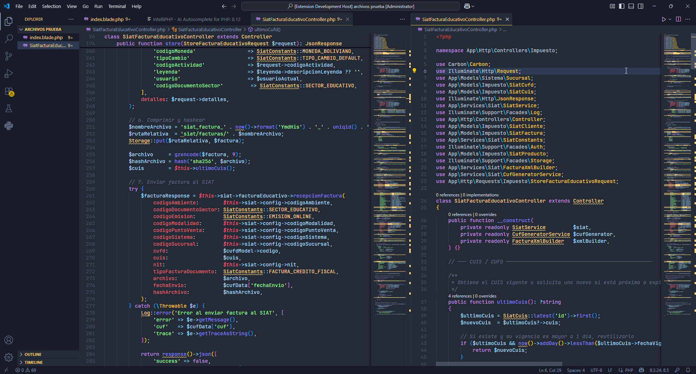
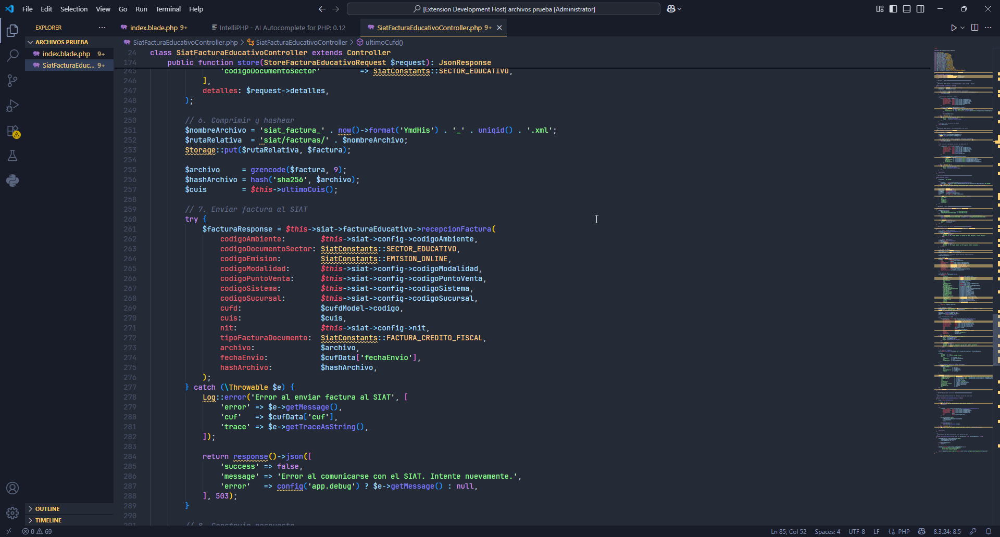
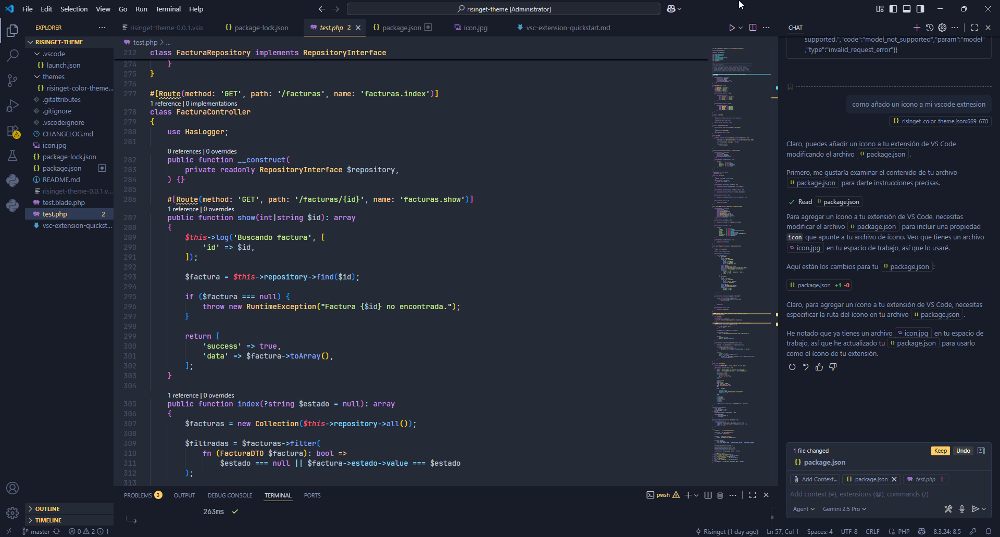
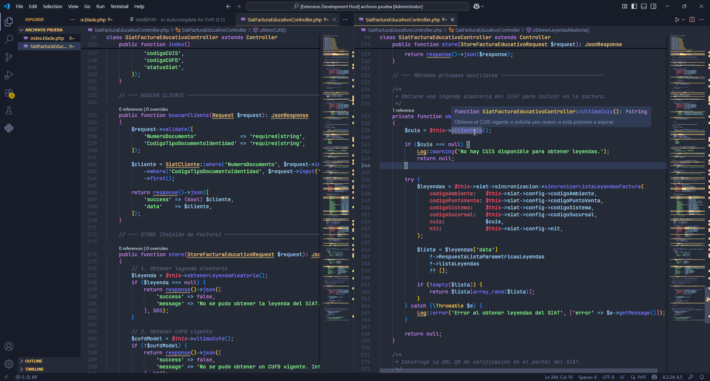

# Risinget Theme

Welcome to Risinget Theme! This theme is heavily inspired by the beautiful syntax highlighting found in the official Laravel documentation. If you love the clean and vibrant look of Laravel's code blocks, you'll feel right at home with this theme.

The Risinget Theme is designed to be easy on the eyes while providing clear and distinct colors for all your coding needs. It's perfect for web developers, especially those working with PHP and Laravel.

## Features

*   **Laravel-Inspired Colors:** Enjoy a familiar color palette that mirrors the Laravel documentation.
*   **Enhanced Readability:** The color choices are optimized for long coding sessions, reducing eye strain.
*   **Comprehensive Syntax Highlighting:** We've covered a wide range of languages and file types to ensure a consistent experience.

## Screenshots

Here are a few screenshots of the Risinget Theme in action:

### Image 1

### Image 2

### Image 3

### Image 4

## Installation

1.  Open the **Extensions** sidebar in VS Code. `View → Extensions`.
2.  Search for `Risinget Theme`.
3.  Click **Install**.
4.  Open the **Command Palette** with `Ctrl+Shift+P` or `Cmd+Shift+P`.
5.  Select `Preferences: Color Theme` and choose **Risinget Theme**.

**Enjoy!**
